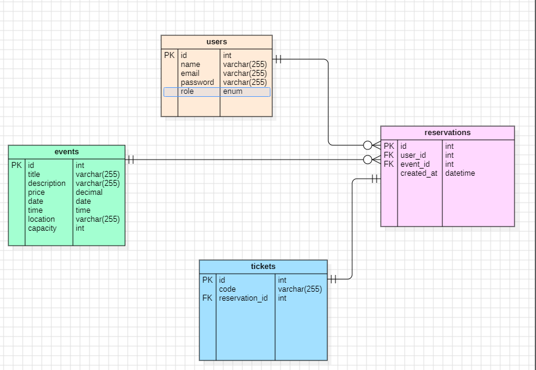

# BDE Events
## Description

BDE-Events est une application web développée avec Laravel permettant de gérer les événements organisés par le Bureau des Élèves (BDE). Elle offre un espace dédié aux étudiants pour consulter les événements, réserver une place et obtenir un billet avec un code unique.

## Foncionalités
###  Étudiant
- Connexion sécurisée
- Consulter les événements disponibles
- Réserver une place
- Empêcher les réservations en double
- Consulter les billets
- Génération automatique d'un code de ticket unique

###  BDE
- Créer un événement
- Gérer les places disponibles


##  Technologies utilisées

- Laravel
- PHP
- MySQL
- Tailwind CSS
- Git
- GitHub
- StarUML
- Jira
## Diagrammes UML

### Diagramme de classes


### Diagramme de cas d'utilisation


### Diagramme ERD




##  Installation

### 1. Cloner le projet

```bash
git clone https://github.com/kaoutarouissa/BDE-Events.git
```

### 2. Accéder au dossier

```bash
cd BDE-Events
```

### 3. Installer les dépendances

```bash
composer install
```

### 4. Copier le fichier d'environnement

```bash
cp .env.example .env
```

### 5. Générer la clé

```bash
php artisan key:generate
```

### 6. Configurer la base de données

Modifier le fichier **.env** avec vos informations MySQL.

### 7. Lancer les migrations

```bash
php artisan migrate
```

### 8. Démarrer le serveur

```bash
php artisan serve
```


##  Auteur

**Réalisé par :** Kaoutar Ouissa

---

## Licence

Projet réalisé dans un cadre pédagogique.